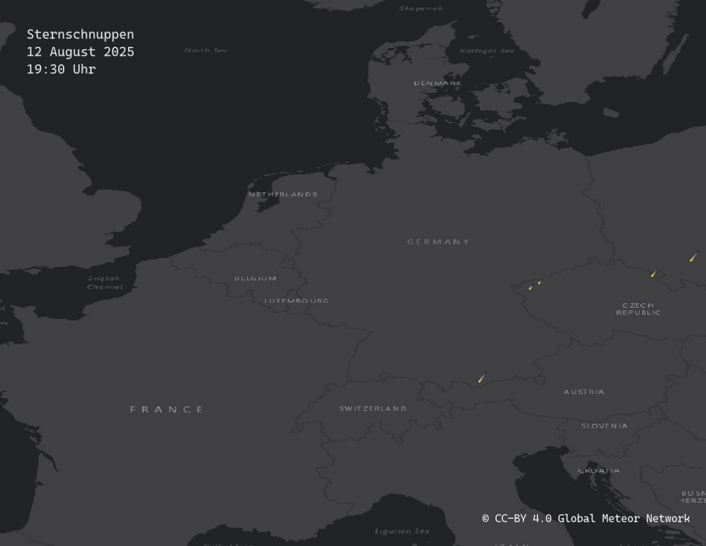
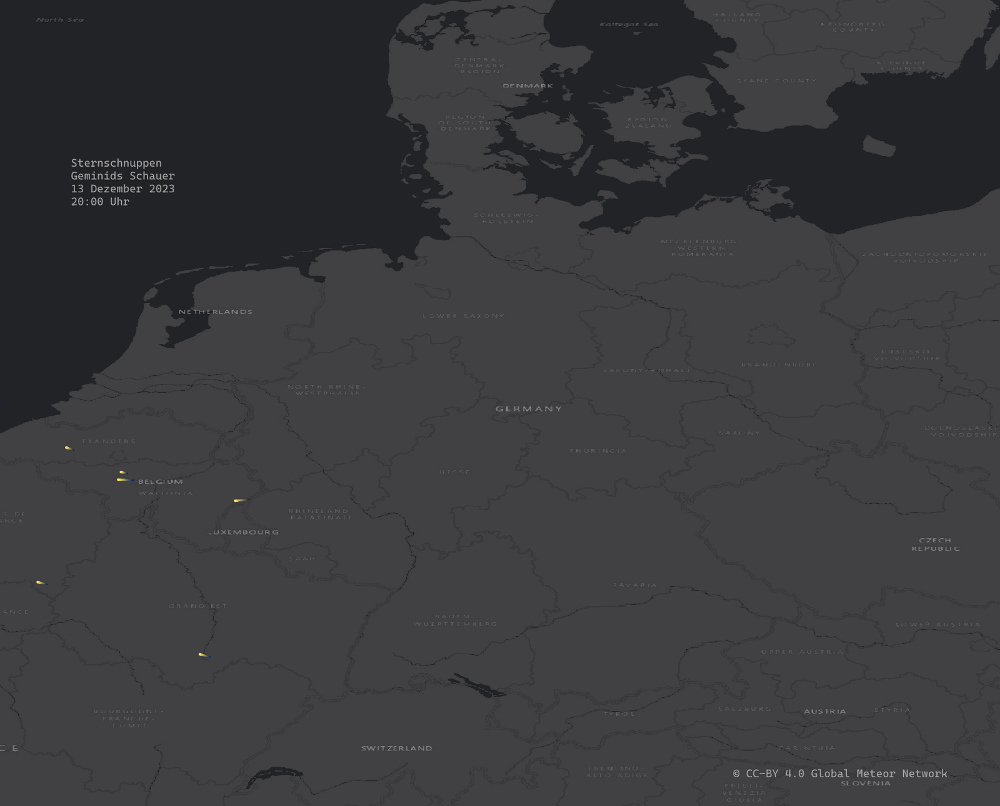
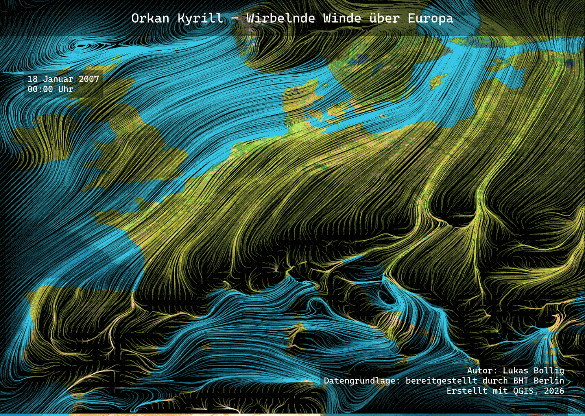

# DTM Desktop-Mapping

## Eine Reise durch das Semester

<table>
<tr>
<td width="65%" valign="top">

Willkommen zu meiner kleinen Reise durch das Modul <strong>DTM – Desktop-Mapping</strong>. Zwischen Daten, Farben, Symbolen und gelegentlichem QGIS-Chaos entstanden im Laufe des Semesters ganz unterschiedliche Karten. Diese Seite zeigt die einzelnen Etappen, Ergebnisse und Erkenntnisse – mit viel Freude am Kartengestalten und natürlich <strong>powered by dem „Helden der Karten“</strong>.

</td>
<td width="35%" valign="middle" align="center">

</td>
</tr>
</table>

## EP 01 | Dasymetrische Choropletenkarten

### Vor- und Nachteile der dasymetrischen Darstellung

Die dasymetrische Karte stellt die Bevölkerung nur innerhalb der tatsächlich besiedelten Flächen dar. Unbewohnte Bereiche wie Wälder, Gewässer, Parks oder große Gewerbeflächen werden weitgehend ausgeschlossen. Dadurch entsteht ein räumlich differenzierteres und realitätsnäheres Bild der Bevölkerungsverteilung als bei einer klassischen Choroplethenkarte, die einen Wert gleichmäßig auf die gesamte Verwaltungseinheit überträgt. Besonders in unterschiedlich dicht bebauten Gebieten lassen sich Bevölkerungsschwerpunkte so besser erkennen.

Die Methode benötigt jedoch zusätzliche und möglichst aktuelle Daten zur Flächennutzung oder Bebauung. Ungenauigkeiten in diesen Daten wirken sich direkt auf das Ergebnis aus. Außerdem bleibt die Bevölkerung innerhalb der ausgewählten Siedlungsflächen meist rechnerisch gleichmäßig verteilt, obwohl die tatsächliche Einwohnerzahl beispielsweise zwischen Einfamilienhausgebieten und Großwohnsiedlungen stark variiert. Die Erstellung ist daher aufwendiger und das Ergebnis trotz der höheren räumlichen Genauigkeit weiterhin eine modellhafte Annäherung.

### Umsetzung der Methode

Zunächst wurden die Einwohnerzahlen den Berliner LOR-Planungsräumen zugeordnet und sowohl als absolute Werte als auch als Bevölkerungsdichte dargestellt. Für die dasymetrische Karte wurden die LOR anschließend mit den tatsächlichen Siedlungsflächen verschnitten. Die Einwohnerzahl jedes Planungsraums wurde auf dessen bewohnte Fläche bezogen und als Einwohner je Quadratkilometer Siedlungsfläche neu berechnet. Eine abgestufte Farbskala macht die so ermittelten Dichteunterschiede sichtbar.

## EP.02 | Gitterchoroplethenkarten

### Vor- und Nachteile der Methode

Gitterchoroplethenkarten fassen Punktdaten in gleich großen Flächen zusammen. Dadurch lassen sich räumliche Häufungen gut vergleichen, ohne dass unterschiedlich große Verwaltungsgebiete das Kartenbild beeinflussen. Bei den Berliner Kirschbäumen werden so Verbreitungsschwerpunkte sichtbar. Allerdings gehen die genauen Baumstandorte durch die Zusammenfassung verloren. Auch die Größe und Lage des Gitters beeinflussen das Ergebnis: Je größer die Zellen, desto stärker werden lokale Unterschiede geglättet.

### Umsetzung der Methode

Die Kirschbaumstandorte aus dem Open-Data-Portal des Landes Berlin wurden mit einem Hexagongitter mit 500 Metern Seitenlänge überlagert. Anschließend wurde die Anzahl der erfassten Kirschbäume je Hexagon bestimmt und durch eine abgestufte Farbskala dargestellt. Zellen ohne Kirschbäume wurden ausgeblendet. Eine dunkle Hintergrundkarte sorgt dafür, dass die eingefärbten Hexagone deutlich hervortreten.
#### Berlin blüht hier zunächst im Sechseck.

## EP.03 | Punktrasterkarten

### Vor- und Nachteile der Methode

Punktrasterkarten stellen zusammengefasste Werte durch Symbole an regelmäßig angeordneten Positionen dar. Unterschiedliche Symbolgrößen machen räumliche Schwerpunkte erkennbar, während zwischen den Symbolen die Hintergrundkarte sichtbar bleibt. Die Kirschblüten stellen außerdem einen direkten Bezug zum Thema her. Allerdings lassen sich genaue Mengen anhand komplexer Symbole nur schwer abschätzen. Große Symbole können sich überlagern, außerdem zeigen ihre Positionen die Gitterzellen und nicht die tatsächlichen Standorte einzelner Bäume.

### Umsetzung der Methode

Als Grundlage diente das Hexagongitter aus EP 02 mit den bereits ermittelten Kirschbaumzahlen. Statt die Gitterflächen einzufärben, wurde jeweils ein zentriertes Kirschblütensymbol dargestellt. Größe und Farbintensität wurden an die Anzahl der Kirschbäume angepasst: Je mehr Bäume im jeweiligen Bereich erfasst sind, desto größer und kräftiger erscheint die Blüte.
#### Aus dem nüchternen Gitter wurde damit ein kleines kartographisches Blütenmeer.

## EP.04 | Value-By-Alpha Mapping

### Vor- und Nachteile der Methode

Value-By-Alpha Mapping verbindet zwei Informationen in einer Darstellung: Die Farbe kennzeichnet hier die siegreiche Partei, ihre Intensität die Deutlichkeit des Wahlsiegs. Dadurch werden knappe und klare Ergebnisse auf einen Blick unterscheidbar. Allerdings sind sehr blasse Flächen schwer zuzuordnen und können mit fehlenden Daten verwechselt werden. Auch beeinflusst der Hintergrund die Farbwahrnehmung. Wie bei klassischen Choroplethenkarten wirken große Wahlkreise zudem optisch dominanter, unabhängig von ihrer Einwohnerzahl.

### Umsetzung der Methode

Die Wahlergebnisse wurden mit den ungarischen Wahlkreisgeometrien verknüpft. Zunächst entstanden zwei Choroplethenkarten mit den prozentualen Stimmenanteilen von Fidesz und Tisza. Für die Value-By-Alpha-Karte erhielt jeder Wahlkreis die Farbe der siegreichen Partei. Eine unterschiedlich transparente weiße Überlagerung schwächt diese Farbe abhängig vom Stimmenvorsprung ab: Knappe Ergebnisse erscheinen blasser, deutliche Siege kräftiger. Alle drei Darstellungen wurden in einem gemeinsamen A3-Layout zusammengeführt.

## EP.05 | Ursprung-Ziel-Karten

### Vor- und Nachteile der Methode

Ursprung-Ziel-Karten machen räumliche Verbindungen zwischen einem Herkunftsort und mehreren Zielorten sichtbar. Bei der Flucht aus dem Sudan lassen sich so die Aufnahmeländer und Unterschiede in den zugeordneten Flüchtlingszahlen erkennen. Viele Verbindungen können sich jedoch überlagern und die Lesbarkeit erschweren. Wichtig ist außerdem, dass die Linien keine tatsächlichen Fluchtrouten darstellen. Die orthographische Projektion vermittelt einen anschaulichen Globuseindruck, zeigt aber nur eine Erdhalbkugel und staucht Gebiete am Rand.

### Umsetzung der Methode

Die UNHCR-Daten zu Geflüchteten aus dem Sudan wurden den jeweiligen Aufnahmeländern zugeordnet. Verbindungslinien verknüpfen den Sudan als Herkunftsland mit den Zielländern, ihre Farbabstufung stellt die Größenordnung der Flüchtlingszahlen dar. Die Aufnahmeländer wurden zusätzlich grün hervorgehoben. Eine auf den Sudan zentrierte orthographische Projektion sowie ein gestalteter Erdhintergrund bilden den räumlichen Rahmen der Karte.

## EP.06 | Tilemaps

### Vor- und Nachteile der Methode

Tilemaps reduzieren geografische Strukturen auf regelmäßige Kacheln und schaffen dadurch eine übersichtliche, einprägsame Darstellung. In der Klemmbaustein-Optik wird Deutschlands Relief spielerisch zugänglich, während die Höhenfarben großräumige Unterschiede erkennen lassen. Durch die Vereinfachung gehen jedoch Details der Landesgrenze und des Geländes verloren. Die mittlere Höhe einer Kachel glättet einzelne Gipfel und Täler. Für eine präzise Geländeanalyse ist die Karte daher weniger geeignet. 
Zum kartographischen Bauen dagegen umso mehr.

### Umsetzung der Methode

Über Deutschland wurde ein regelmäßiges rechteckiges Gitter gelegt und auf die für die Darstellung benötigten Zellen begrenzt. Aus dem digitalen Höhenmodell wurde für jede Kachel die mittlere Geländehöhe ermittelt. Anschließend erhielten die Zellen eine abgestufte Höhenfärbung von Grün bis Orange sowie eine Gestaltung mit Noppen in Klemmbaustein-Optik. Das Ergebnis wurde als vollständiges A3-Kartenlayout ausgegeben.

#### Ganz ohne schmerzhafte Bausteine auf dem Fußboden.

## EP.07 | Animation in QGIS

### Vor- und Nachteile der Methode

Animierte Karten machen neben der räumlichen Verteilung auch die zeitliche Abfolge von Ereignissen sichtbar. Bei den Geminiden lässt sich so verfolgen, wann und wo Meteore registriert wurden. Allerdings können kurze Ereignisse beim Betrachten leicht übersehen werden, und verschiedene Zeitpunkte sind schwer direkt vergleichbar. Die Wiedergabegeschwindigkeit beeinflusst den Eindruck zusätzlich. Außerdem zeigen die Daten nur erfasste Meteore: Unterschiede können auch durch Wetterbedingungen und die Verteilung der Beobachtungsstationen entstehen.

### Umsetzung der Methode

Die ausgewählten Geminiden-Daten wurden in QGIS eingelesen und die Zeitangaben in ein nutzbares Datum-Zeit-Feld überführt. Mithilfe der zeitlichen Steuerung wurden die Meteorereignisse in minutengenauen Schritten eingeblendet. Leuchtende Symbole auf einer dunklen Hintergrundkarte heben die Sternschnuppen hervor, ein Zeitstempel ermöglicht die zeitliche Orientierung. Die Einzelbilder wurden als PNG exportiert und anschließend zu einer GIF-Animation zusammengesetzt.

#### Diesmal durfte sich auf der Karte etwas bewegen.

## EP.08 | Mesh-Daten

### Vor- und Nachteile der Methode

Mesh-Daten ermöglichen die Darstellung räumlich zusammenhängender und zeitlich veränderlicher Größen wie Windfeldern. Strömungslinien machen deren Verlauf anschaulich und lassen großräumige Strukturen erkennen. Die Animation verdeutlicht zusätzlich die zeitliche Entwicklung. Eine dichte, künstlerische Darstellung kann jedoch die geografische Orientierung erschweren; genaue Geschwindigkeiten lassen sich ohne passende Legende kaum ablesen. Auch die räumliche und zeitliche Auflösung der Ausgangsdaten begrenzt den Detailgrad.

### Umsetzung der Methode

Der bereitgestellte GRIB-Datensatz zum Orkan Kyrill wurde als Netzlayer in QGIS geladen. Das enthaltene Windfeld wurde mithilfe einer Strömungsdarstellung visualisiert und in Blau- und Gelbtönen gestaltet. Die wirbelnden Linien greifen die gewünschte Anmutung eines Gemäldes im Stil van Goghs auf. Für den gewählten Zeitraum wurden die Zeitschritte mit Titel, Zeitstempel und Impressum als Animation ausgegeben und zu einer GIF-Datei zusammengeführt
#### Wetterdaten mit einem Hauch Atelier.

## EP.09 | 3D-Gebäudemodelle

### Vor- und Nachteile der Methode

2,5D- und 3D-Darstellungen machen Gebäudehöhen und städtische Strukturen anschaulicher als eine reine Grundrisskarte. Die 2,5D-Ansicht verbindet eine übersichtliche Kartenbasis mit einem räumlichen Eindruck, während detaillierte 3D-Modelle zusätzlich Dachformen und markante Bauwerke zeigen können. Allerdings verdecken hohe Gebäude je nach Blickrichtung andere Objekte. Detaillierte Modelle benötigen zudem mehr Rechenleistung und Speicherplatz. Vereinfachte LoD1-Modelle stellen Gebäude nur als Blöcke dar und bilden keine tatsächlichen Dachformen ab.

### Köln als 3D Modell

Kartenerstellung: Lukas Bollig, BHT, 2026
Gebäudedaten und Luftbild: Land NRW – Geobasis NRW
3D-Gebäudemodell und WMS-Orthophoto
Datenlizenz Deutschland – Zero – Version 2.0

### Umsetzung der Methode

Für Düren wurden aus den LoD1-Gebäudedaten Grundrisse und zugehörige Gebäudehöhen aufbereitet. Die Grundrisse wurden in QGIS mit der 2,5D-Symbolisierung entsprechend ihrer Höhe aufgezogen und durch Dachfarben und Schatten räumlich hervorgehoben. Eine Hintergrundkarte ergänzt Straßen und Orientierungspunkte. Die zusätzliche 3D-Ansicht von Köln zeigt detailliertere Gebäude einschließlich ihrer Dachformen über einer Luftbildgrundlage. 
#### Zum Semesterabschluss ging es damit noch einmal in die Höhe.
